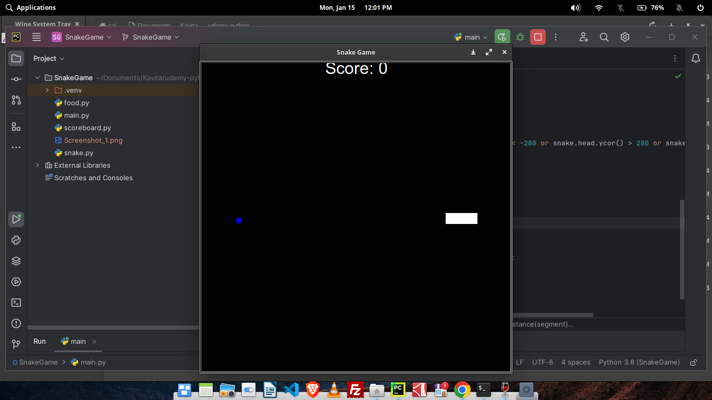

# Snake Game using Turtle Library in Python

A simple Snake Game implementation in Python using the Turtle graphics library.



## Features

- Classic Snake Game with a graphical interface.
- Uses the Turtle graphics library for rendering.

## Requirements

- Python 3.x
- Turtle library (usually comes pre-installed with Python)

## How to Play

1. Clone the repository:

   ```bash
   git clone https://github.com/kcvaghasiya/snake-game.git

2. Change into the project directory:
   
   ```bash
   cd SnakeGame
   
3. Run the game:

 ```bash
python main.py
