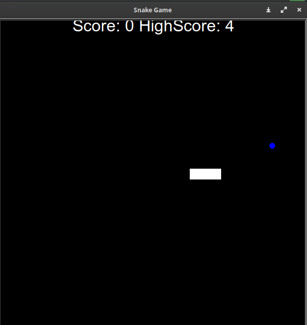

# Snake Game using Turtle Library in Python

A simple Snake Game implementation in Python using the Turtle graphics library.

## Features

- Classic Snake Game with a graphical interface.
- Uses the Turtle graphics library for rendering.

## Requirements

- Python 3.x
- Turtle library (usually comes pre-installed with Python)

## How to Play

1. Clone the repository:

   ```bash
   git clone https://github.com/kcvaghasiya/snake-game.git

2. Change into the project directory:
   
   ```bash
   cd SnakeGame
   
3. Run the game:

   ```bash
   python main.py

4. Use the arrow keys to control the snake:

   Up arrow: Move the snake up
   Down arrow: Move the snake down
   Left arrow: Move the snake left
   Right arrow: Move the snake right
   
6. Try to eat the food (green square) to grow the snake.



## Contributions
Contributions are welcome! If you find any bugs or have suggestions for improvement, feel free to open an issue or submit a pull request.

## License
This project is licensed under the MIT License - see the LICENSE file for details.
